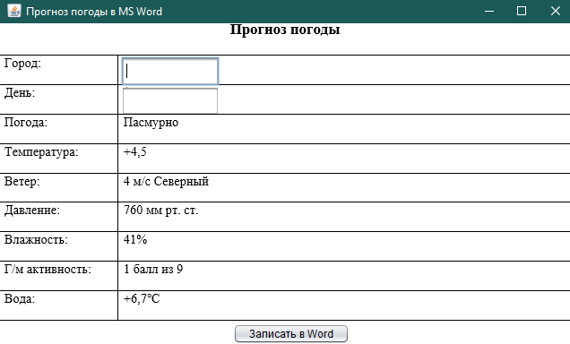
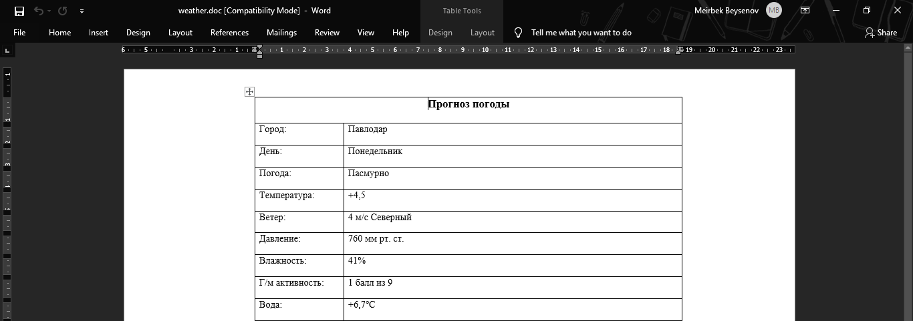

# BMK_JAVA_poi.msword

Программа формирования оригинального отчета (заполненного бланка) в MS Word с использованием Apache POI 

Решение 5 задания 
Вариант - 1 (Погода)

Интерфейс программы: 
  
Данные, экспоритрованные в Word: 

